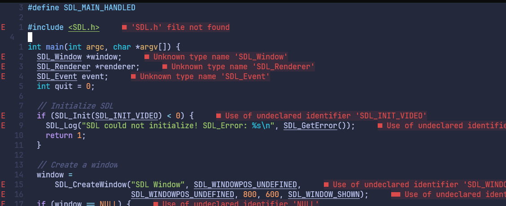
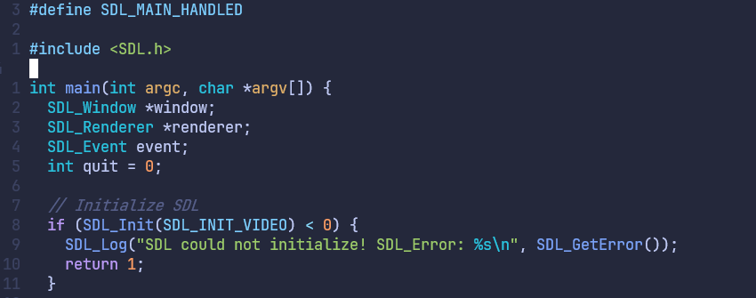

# Week 16 of Paw - Neovim Cpp LSP Support for External Libraries

This week's project of the week is going to take form in more of a guide. Recently, I've been interested in learning more about the SDL2 (Simple DirectMedia Layer) library that provides low level access to computer audio, user input and graphics - which is useful for creating games. The following guide assumes installation of Neovim and a couple of LSP related plugins.

## Requirements
- Neovim (configurable text editor fork of vi)
- nvim-lspconfig (lsp client)
- clangd (lsp language server for c/cpp)

## Problem:
Neovim doesn't know where external header files are.

## Solution:
Specify where the clangd lsp language server should look for external files using the `compile_flags.txt` file.

1. Create the `compile_flags.txt` file in the project root directory.
2. Fill in the directories for `include` and `lib` with the `-I` and `-L` flags respectively.
3. An example is shown below on how to do this with the [SDL](https://www.libsdl.org/) library



`compile_flags.txt`

```
-I/path/to/include
-lSDL2
-L/path/to/lib

```


